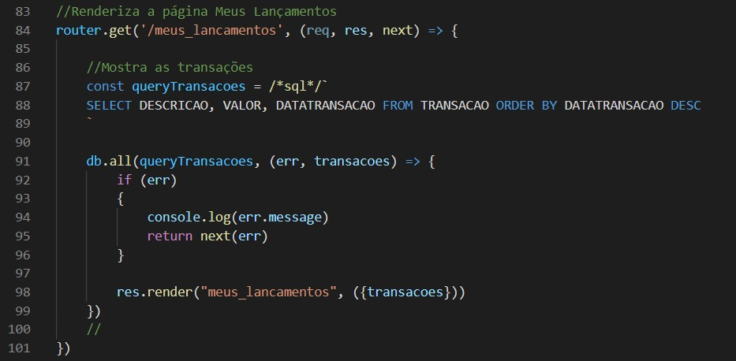
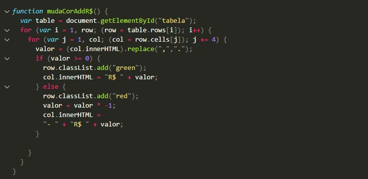
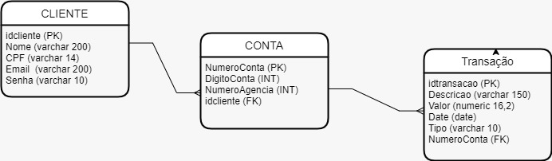
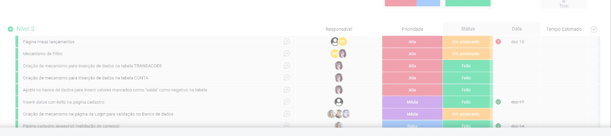

<h1 align="center">AppGestaoFinanceira</h1> 
 

### Nossa proposta 

 🔹 Desenvolver um aplicativo de gestão financeira pessoal 

 🔹 Com o design inspirado na temática LGBTQIA+
  
  

 

<h2 align="center">Ferramentas utilizadas<h2>
  
 

   -  -
   -  - 
   -  -
  
  

  
  
  <h3>Organização da equipe: </h3>
  
  <h4>Front-end: </h4> 
 Oriana Salazar, Ruan Marques e Julia Soares. 

  <h4>Back-end/Banco de dados : </h4> 
 Helena Fonseca, Esteban Gonzalez e Rui Lagos. 

 
  
   <h3 align="center">Highlights 🌟 </h3> 
  

   
  

   
  

   
  

  
  

   
  <h3 align="center">Diagrama do banco de dados</h3> 
  

   
  

  
    
  

  
  
  <h3 align="center">Organização</h3> 
  

  
     
  
  

  
  
  

  
  <h2 > Contribuidores </h2>  
  
  <b>Oriana Salazar</b>  
       &nbsp;
   &nbsp;
   &nbsp;
  
    
      
"Aprendi que valorizar o processo é mais importante do que finalizá-lo, me diverti muito, trabalhamos com base na honestidade, na simplicidade e na pró-atividade, pois sabemos que somos os principais protagonistas da nossa história. Demos pequenos passos, mas com grande motivação. Eu amo minha equipe porque todos nós pensamos que um por todos e todos por um!"

    

  <b> Rui Lagos</b>  
       &nbsp;
   &nbsp;
   &nbsp;
  
    
      
    
"	Foi para mim uma experiência estimulante que colocou à prova os meus conhecimentos e me deu uma noção  muito mais alargada do que é trabalho em equipe em uma grande corporação. O principal aprendizado foi a nível das dificuldades que surgem no meio de uma equipe constituída por diferentes personalidades e formas de encarar dificuldades em que temos de manter bom senso e nos sabermos movimentar da melhor forma."

    

  <b>Helena Fonseca</b>  
       &nbsp;
   &nbsp;
   &nbsp;
  
    
    
    
"O projeto foi um desafio pela questão da integração entre back e front end, saio desse trabalho com muito mais compreensão sobre esse assunto."

    

  <b>Ruan Marques</b>  
       &nbsp;
   &nbsp;
   &nbsp;
  
   
    
"Cheguei ao fim desta jornada com um sentimento de dever cumprido. A colaboração entre o grupo foi essencial para o sucesso do Projeto!"

   

  <b>Julia Soares</b>  
       &nbsp;
   &nbsp;
   &nbsp;
  
    
    
"Eu entendi a importância da organização em um projeto e tive a oportunidade de viver momentos extremamente divertidos com meus companheiros de equipe."

    

  <b>Esteban Gonzalez Gomez</b>  
       &nbsp;
   &nbsp;
   &nbsp;
  
    
    
    
"Neste tempo de projeto aprendi a importância da comunicação entre sua equipe, e o valor e pontencial que você dá a cada um dos membros."

    
  
 

 

 
 
 
